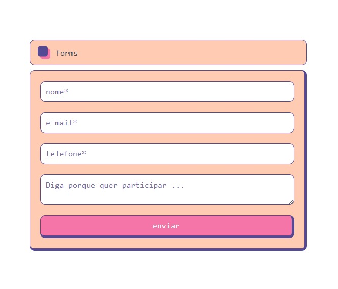

## GERADOR DE PDF E E-MAIL

by: [@v.ii.n.i](https://instagram.com/v.ii.n.i)

    Web-app made with JS, Express, Nodejs and jsPDF. It's PDFs generator, also send message for e-mail. 

### Mas por que?

    Estudo DS(Densevolvimento de Sistemas) e foi passado o desafio de criar um site full-stack, onde teria um formulário a ser preenchido para o controle de incrições em um Hackathon (evento sobre tecnologia), após o preenchimento do forms o arquivo gerado deve ser anexado a um email que será enviado para o email especificado.

### ?Como rodar?

1º npm install

2º node ./server.js

E pronto 😎